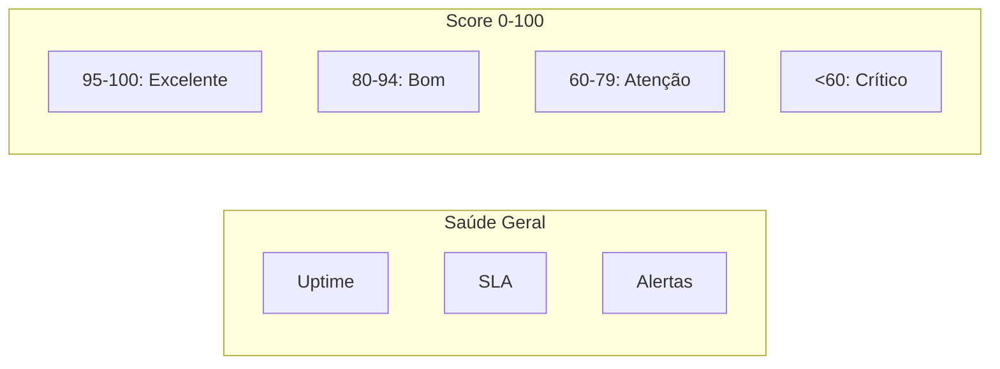

# 📊 KPI Dashboard - Visão Geral

## Métricas Chave de Performance

Este documento define os KPIs monitorados pelo Portal Inner.

---

## 🎯 KPIs por Módulo

### Dashboard Geral



| KPI | Descrição | Target | Alerta |
|-----|-----------|--------|--------|
| **Health Score** | Score geral 0-100 | > 85 | < 70 |
| **Uptime** | Disponibilidade % | > 99.5% | < 99% |
| **Active Alerts** | Alertas ativos | < 5 | > 10 |

---

## ☁️ Microsoft 365

| KPI | Descrição | Target | Alerta |
|-----|-----------|--------|--------|
| **License Utilization** | % licenças em uso | 70-90% | < 50% ou > 95% |
| **Active Users** | Usuários ativos/mês | Crescimento | Queda > 20% |
| **SharePoint Usage** | % armazenamento | < 80% | > 90% |
| **Inactive Users** | Usuários sem uso 30d | < 10% | > 20% |

### Cálculo de Utilização

```typescript
const licenseUtilization = (used: number, total: number): number => {
  return Math.round((used / total) * 100);
};

// Exemplo
const utilization = licenseUtilization(45, 50); // 90%
```

---

## 🖥️ Servidores

| KPI | Descrição | Target | Alerta |
|-----|-----------|--------|--------|
| **CPU Usage** | % médio CPU | < 70% | > 85% |
| **Memory Usage** | % médio memória | < 75% | > 90% |
| **Disk Usage** | % disco | < 80% | > 90% |
| **Server Online** | % servidores online | > 99% | < 95% |
| **Avg Response** | Tempo resposta (ms) | < 100ms | > 500ms |

### Thresholds

```typescript
const THRESHOLDS = {
  cpu: { warning: 70, critical: 85 },
  memory: { warning: 75, critical: 90 },
  disk: { warning: 80, critical: 90 },
};
```

---

## 🔧 GLPI / Chamados

| KPI | Descrição | Target | Alerta |
|-----|-----------|--------|--------|
| **Open Tickets** | Chamados em aberto | - | Crescimento > 30% |
| **SLA Compliance** | % dentro do SLA | > 90% | < 85% |
| **Avg Response Time** | Tempo médio 1ª resposta | < 4h | > 8h |
| **Avg Resolution Time** | Tempo médio resolução | < 24h | > 48h |
| **Reopened Tickets** | % reabertos | < 5% | > 10% |

### Cálculo SLA

```typescript
interface SLACalculation {
  totalTickets: number;
  withinSLA: number;
  breached: number;
  
  complianceRate: number; // (withinSLA / totalTickets) * 100
  avgResponseHours: number;
  avgResolutionHours: number;
}
```

---

## 🌐 Rede

| KPI | Descrição | Target | Alerta |
|-----|-----------|--------|--------|
| **Network Uptime** | % disponibilidade | > 99.5% | < 99% |
| **Avg Latency** | Latência média (ms) | < 50ms | > 100ms |
| **Packet Loss** | % perda de pacotes | < 0.1% | > 1% |
| **Devices Online** | % dispositivos online | > 98% | < 95% |

---

## 📊 Dashboard de métricas

### Score Card

```mermaid
gauge
    "Health Score" 78
```

### Status Colors

| Status | Cor | Significado |
|--------|-----|-------------|
| 🟢 **healthy** | Verde | Dentro do target |
| 🟡 **warning** | Amarelo | Próximo ao limite |
| 🔴 **critical** | Vermelho | Acima do limite |
| ⚪ **unknown** | Cinza | Sem dados |

---

## 📈 Visualização

### Gráfico de Tendência

```javascript
// Dados para gráfico Recharts
const trendData = [
  { date: '2026-07-25', score: 92 },
  { date: '2026-07-26', score: 91 },
  { date: '2026-07-27', score: 93 },
  { date: '2026-07-28', score: 88 },
  { date: '2026-07-29', score: 85 },
  { date: '2026-07-30', score: 78 },
  { date: '2026-07-31', score: 82 },
];

// Componente
<LineChart data={trendData} width={600} height={300}>
  <XAxis dataKey="date" />
  <YAxis domain={[0, 100]} />
  <Line type="monotone" dataKey="score" stroke="#3b82f6" />
  <ReferenceLine y={85} stroke="green" label="Target" />
  <ReferenceLine y={70} stroke="red" label="Alert" />
</LineChart>
```

---

## 🔔 Alertas

### Tipos de Alerta

| Tipo | Prioridade | Canal |
|------|-----------|-------|
| **Info** | Baixa | Dashboard |
| **Warning** | Média | Dashboard + Email |
| **Critical** | Alta | Dashboard + SMS + Email |
| **Emergency** | Crítica | Todos + Telefone |

### Condições de Alerta

```typescript
const ALERT_RULES = {
  healthScore: {
    condition: score => score < 70,
    priority: 'critical',
    message: 'Health score abaixo de 70%'
  },
  cpuUsage: {
    condition: usage => usage > 85,
    priority: 'warning',
    message: 'CPU acima de 85%'
  },
  slaCompliance: {
    condition: compliance => compliance < 85,
    priority: 'critical',
    message: 'SLA compliance abaixo de 85%'
  },
  serverOffline: {
    condition: count => count > 0,
    priority: 'critical',
    message: 'Servidor offline detectado'
  }
};
```

---

## 📉 Relatórios

### Disponíveis

| Relatório | Frequência | Formato |
|-----------|-----------|---------|
| **Resumo Semanal** | Domingo | Email |
| **Análise Mensal** | 1º dia | PDF |
| **SLA Report** | Mensal | PDF + Email |
| **Inventory Report** | Sob demanda | PDF |

---

> **Última atualização:** 2026-08
