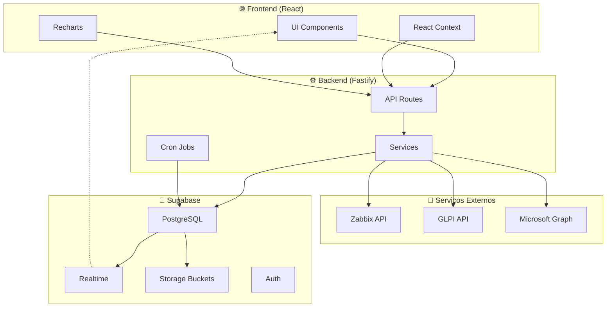
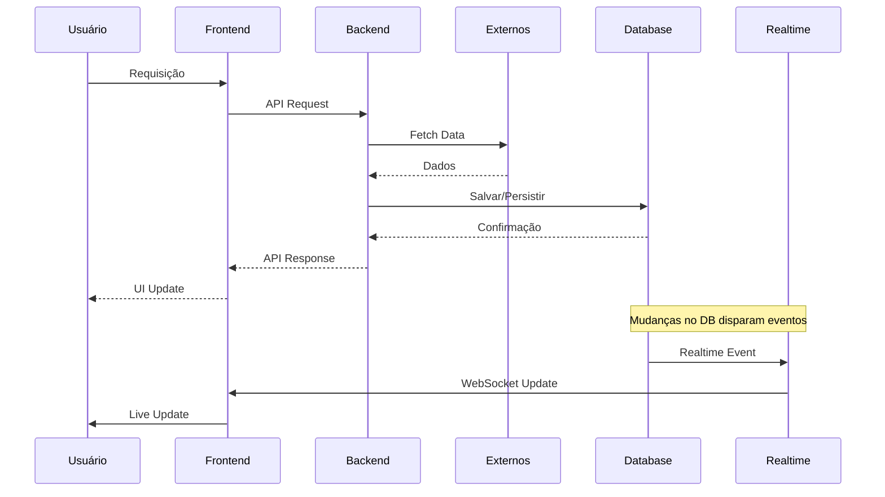

# 💻 Stack Tecnológica

## Visão Geral

O Portal Inner utiliza uma stack moderna e performática, com foco em tempo real, escalabilidade e developer experience.

---

## 🔗 Stack Completa

| Camada | Tecnologia | Versão | Propósito |
|--------|------------|--------|-----------|
| **Frontend** | React | 19.2.0 | UI Library |
| **Frontend Build** | Vite | 7.3.1 | Build tool |
| **Frontend Routing** | React Router | 7.13.1 | SPA routing |
| **Frontend Charts** | Recharts | 3.7.0 | Visualização de dados |
| **Frontend Icons** | Lucide React | 0.577.0 | Ícones |
| **CSS** | Tailwind CSS | 3.4.19 | Utility-first CSS |
| **Backend** | Fastify | 5.8.5 | Web framework |
| **Backend Runtime** | Node.js | 18+ | Runtime |
| **Language** | TypeScript | 5.8.3 | Type safety |
| **Database** | Supabase (PostgreSQL) | - | Database + Realtime |
| **ORM** | Supabase JS Client | 2.48.1 | Database client |
| **Auth** | JWT (@fastify/jwt) | 10.1.0 | Token-based auth |
| **HTTP Client** | Axios | 1.16.1 | API calls |
| **Scheduling** | node-cron | 4.2.1 | Background jobs |
| **File Upload** | @fastify/multipart | 9.4.0 | Multipart handling |
| **Testing** | Vitest | 4.1.7 | Unit testing |

---

## 🏛️ Arquitetura de Dados



---

## 📦 Principais Dependências

### Frontend (`web/package.json`)

```json
{
  "react": "^19.2.0",
  "react-dom": "^19.2.0",
  "react-router-dom": "^7.13.1",
  "recharts": "^3.7.0",
  "lucide-react": "^0.577.0",
  "@supabase/supabase-js": "^2.102.1",
  "axios": "^1.16.1"
}
```

### Backend (`backend/package.json`)

```json
{
  "fastify": "^5.8.5",
  "@fastify/jwt": "^10.1.0",
  "@fastify/cors": "^10.0.0",
  "@fastify/multipart": "^9.4.0",
  "@supabase/supabase-js": "^2.48.1",
  "axios": "^1.16.1",
  "node-cron": "^4.2.1",
  "dotenv": "^16.4.7"
}
```

---

## 🛠️ Ferramentas de Desenvolvimento

| Ferramenta | Propósito |
|------------|-----------|
| **TypeScript** | Type safety em todo o código |
| **ESLint** | Linting e code quality |
| **Vite** | Dev server e build rápido |
| **tsx** | Executar TypeScript diretamente |
| **Vitest** | Testes unitários |

---

## 🌐 Integrações Externas

### Microsoft 365
- **API:** Microsoft Graph API
- **Autenticação:** OAuth 2.0
- **Dados:** Usuários, licenças, SharePoint

### Zabbix
- **API:** Zabbix REST API
- **Autenticação:** Token API
- **Dados:** Métricas de servidores, templates

### GLPI
- **API:** GLPI REST API
- **Autenticação:** App token + User token
- **Dados:** Chamados, SLAs, usuários

---

## 📊 Diagrama de Fluxo de Dados



---

## 🔐 Segurança

| Componente | Tecnologia |
|------------|-----------|
| Autenticação | JWT (JSON Web Tokens) |
| CORS | @fastify/cors |
| Upload | @fastify/multipart com validação |
| Credenciais | Variáveis de ambiente |
| Banco | Supabase Auth + RLS |

---

## 📱 Responsividade

- **Mobile:** Tailwind CSS com breakpoints
- **Breakpoints:**
  - `sm:` 640px
  - `md:` 768px
  - `lg:` 1024px
  - `xl:` 1280px

---

## 🚀 Performance

| Métrica | Meta |
|---------|------|
| First Contentful Paint | < 1.5s |
| Time to Interactive | < 3s |
| Lighthouse Score | > 90 |
| API Response Time | < 500ms |

---

> **Atualizado:** 2026-08
