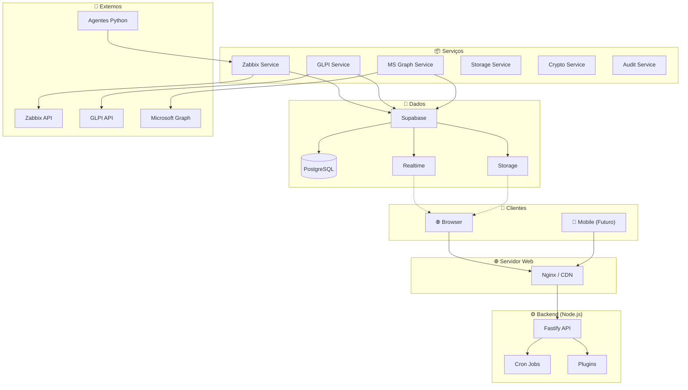
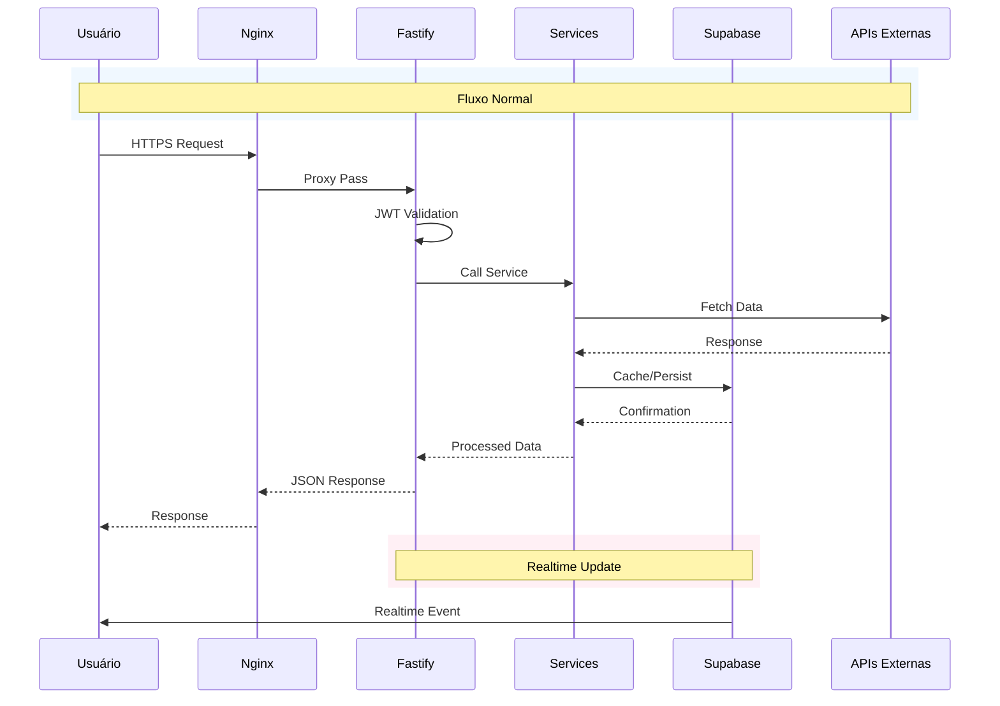
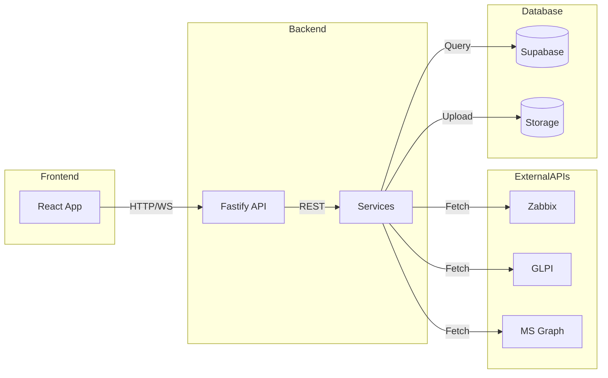
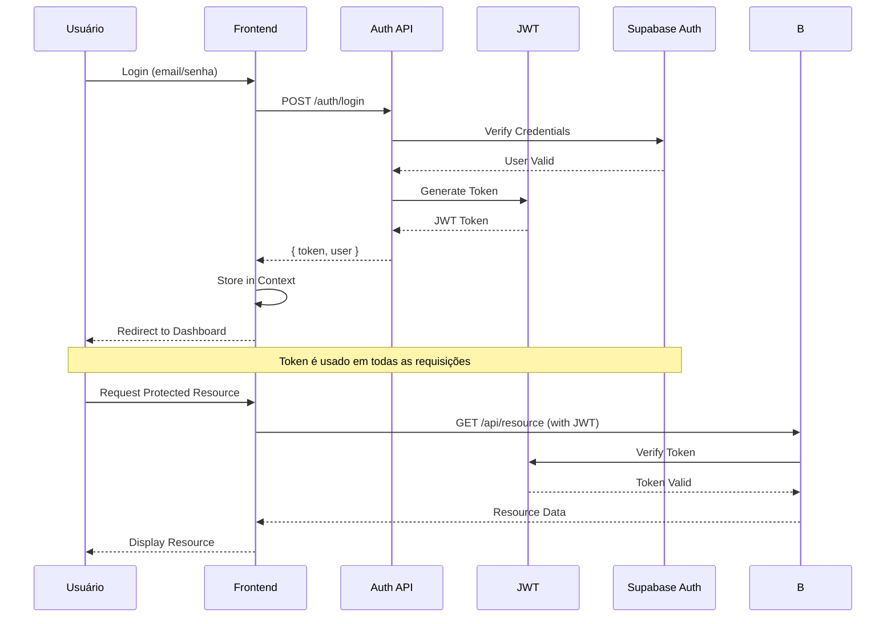
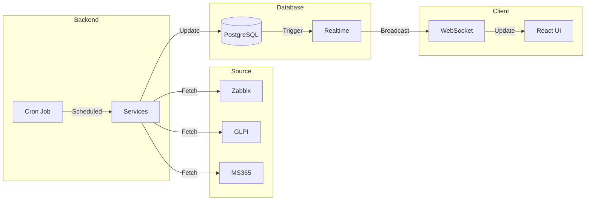

# 🏗️ Diagrama de Arquitetura

## Visão Geral da Arquitetura

O Portal Inner segue uma arquitetura **monolítica modular** com separação clara entre frontend e backend.

---

## 📐 Arquitetura de Alto Nível



---

## 🔀 Arquitetura de Requisições



---

## 📁 Estrutura de Diretórios

### Backend

```
backend/
├── src/
│   ├── app.ts              # Configuração principal do Fastify
│   ├── server.ts           # Entry point
│   ├── types.ts            # Tipos TypeScript globais
│   │
│   ├── routes/             # Rotas da API
│   │   ├── auth.ts         # Autenticação
│   │   ├── agent-routes.ts # Rotas de agentes
│   │   │
│   │   ├── admin/          # Rotas administrativas
│   │   │   ├── agents-routes.ts
│   │   │   ├── audit-routes.ts
│   │   │   ├── companies-routes.ts
│   │   │   ├── config-routes.ts
│   │   │   ├── dashboard-routes.ts
│   │   │   ├── docs-routes.ts
│   │   │   ├── inventory-routes.ts
│   │   │   ├── ms365-routes.ts
│   │   │   ├── security-routes.ts
│   │   │   ├── settings-routes.ts
│   │   │   ├── snmp-routes.ts
│   │   │   └── users-routes.ts
│   │   │
│   │   └── client/         # Rotas de clientes
│   │       ├── dashboard-routes.ts
│   │       ├── docs-routes.ts
│   │       ├── glpi-routes.ts
│   │       ├── metrics-routes.ts
│   │       ├── network-routes.ts
│   │       └── security-routes.ts
│   │
│   ├── services/           # Lógica de negócio
│   │   ├── agent-metrics-service.ts
│   │   ├── asset-profile-service.ts
│   │   ├── audit-service.ts
│   │   ├── company-scope-service.ts
│   │   ├── crypto-service.ts
│   │   ├── glpi-service.ts
│   │   ├── history-service.ts
│   │   ├── integration-status-service.ts
│   │   ├── monitoring-events-service.ts
│   │   ├── ms-graph-service.ts
│   │   ├── settings-service.ts
│   │   ├── snmp-collector-service.ts
│   │   ├── storage-service.ts
│   │   └── zabbix-service.ts
│   │
│   ├── plugins/            # Plugins Fastify
│   │   ├── cors.ts
│   │   ├── jwt.ts
│   │   ├── maintenance.ts
│   │   ├── multipart.ts
│   │   └── supabase.ts
│   │
│   ├── hooks/              # Hooks Fastify
│   │   └── auth-hook.ts
│   │
│   └── jobs/              # Jobs cron
│       └── sync-scheduler.ts
│
├── migrations/            # Scripts SQL
│   ├── migration_001.sql
│   └── ...
│
├── package.json
└── tsconfig.json
```

### Frontend

```
web/
├── src/
│   ├── main.jsx           # Entry point
│   ├── App.jsx            # Componente raiz
│   │
│   ├── components/       # Componentes reutilizáveis
│   │   ├── AssetDetailDrawer.jsx
│   │   ├── MobileHeader.jsx
│   │   ├── ProtectedRoute.jsx
│   │   ├── Sidebar.jsx
│   │   ├── SidebarAdmin.jsx
│   │   ├── TicketDetailDrawer.jsx
│   │   └── ...
│   │
│   ├── contexts/          # React Contexts
│   │   ├── AuthContext.jsx
│   │   ├── ClientPreviewContext.jsx
│   │   └── CompanyContext.jsx
│   │
│   ├── layouts/           # Layouts de página
│   │   ├── AdminLayout.jsx
│   │   ├── ClientPreviewLayout.jsx
│   │   └── layout.jsx
│   │
│   ├── pages/              # Páginas
│   │   ├── Login/
│   │   ├── RecuperarSenha/
│   │   ├── RedefinirSenha/
│   │   │
│   │   ├── paginasAdmin/   # Páginas admin
│   │   │   ├── agentesAdmin/
│   │   │   ├── auditAdmin/
│   │   │   ├── configAdmin/
│   │   │   ├── dashAdmin/
│   │   │   ├── docAdmin/
│   │   │   ├── empresasAdmin/
│   │   │   ├── inventarioAdmin/
│   │   │   ├── segurancaAdmin/
│   │   │   ├── snmp/
│   │   │   └── usuariosAdmin/
│   │   │
│   │   └── paginasClient/  # Páginas cliente
│   │       ├── ChamadosGLPI/
│   │       ├── Conta/
│   │       ├── Dashboard/
│   │       ├── Documentação/
│   │       ├── Microsoft/
│   │       ├── Rede/
│   │       ├── Segurança/
│   │       └── Servidores/
│   │
│   └── rotas/
│       └── rotas.jsx      # Definição de rotas
│
├── package.json
├── vite.config.js
└── tailwind.config.js
```

---

## 🔌 Conexões de Dados



---

## 🔐 Fluxo de Autenticação



---

## 🔄 Fluxo de Dados em Tempo Real



---

## 📊 Componentes de Infraestrutura

| Componente | Tecnologia | Propósito |
|------------|------------|-----------|
| **API Server** | Fastify | REST API |
| **Database** | Supabase PostgreSQL | Persistência |
| **Realtime** | Supabase Realtime | WebSockets |
| **Storage** | Supabase Storage | Arquivos |
| **Auth** | Supabase Auth + JWT | Autenticação |
| **Proxy** | Nginx | Load balancing, SSL |
| **Workers** | Cron Jobs | Processamento agendado |

---

## 🔒 Arquitetura de Segurança

Consulte [[02-Arquitetura/Segurança]] para detalhes completos.

---

> **Última atualização:** 2026-08
