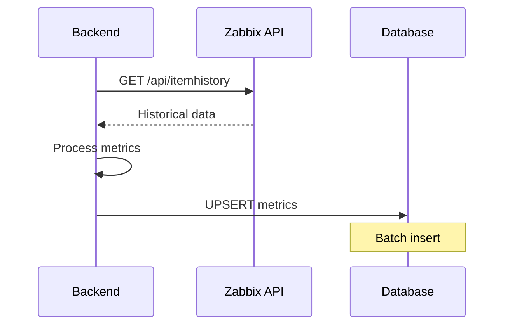
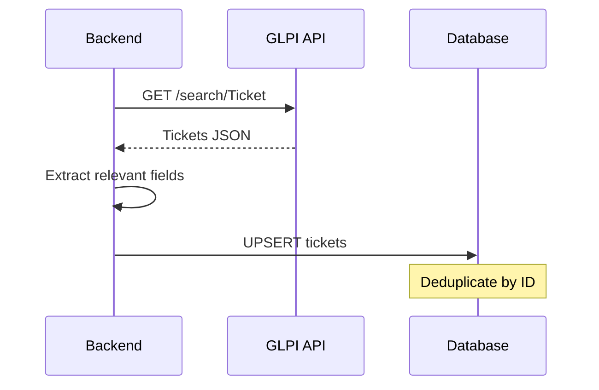
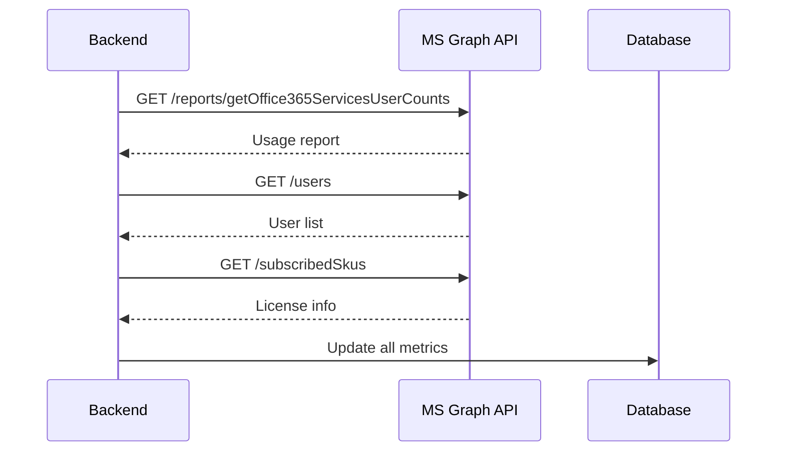
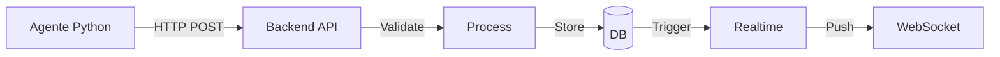
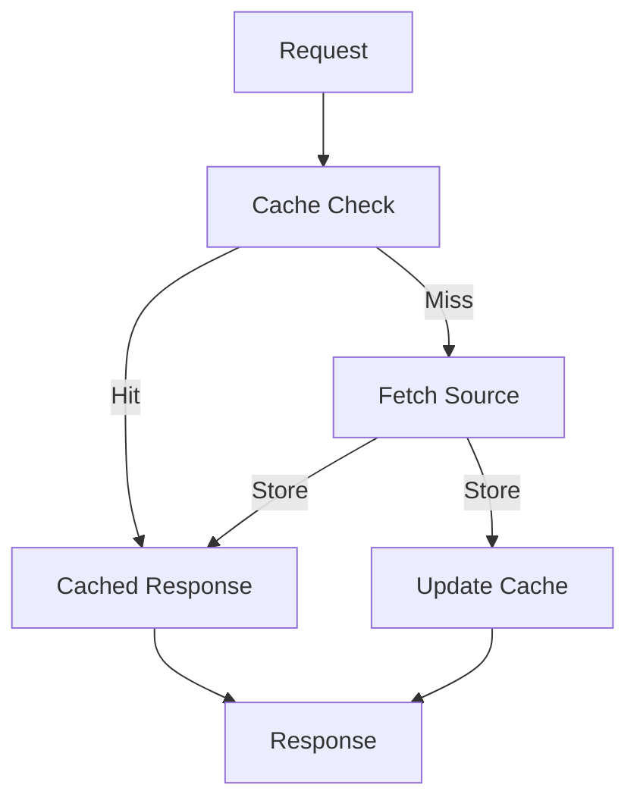
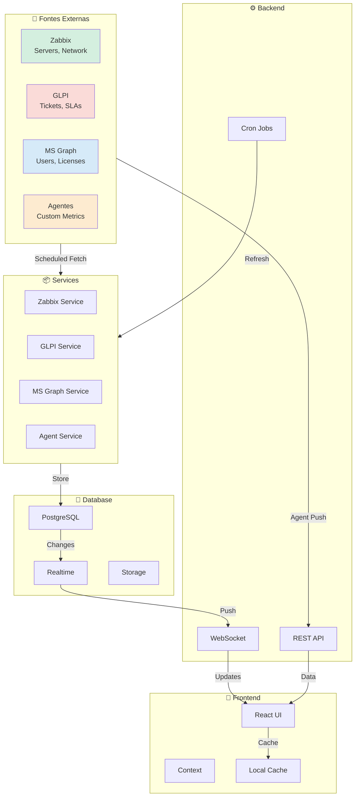
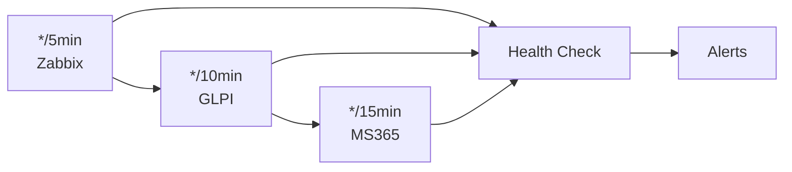

# 📊 Fluxo de Dados

## Visão Geral

Este documento descreve como os dados fluem através do sistema Portal Inner, desde as fontes externas até a interface do usuário.

---

## 🔄 Ciclo de Vida dos Dados

```mermaid
graph LR
    subgraph Sources["📥 Fontes"]
        Zabbix["Zabbix"]
        GLPI["GLPI"]
        MSGraph["MS Graph"]
        Agents["Agentes"]
    end
    
    subgraph Ingestion["⚙️ Ingestão"]
        Fetch["Fetch"]
        Transform["Transform"]
        Validate["Validate"]
    end
    
    subgraph Storage["💾 Armazenamento"]
        Cache["Cache"]
        Database["PostgreSQL"]
        Realtime["Realtime"]
    end
    
    subgraph Presentation["🎨 Apresentação"]
        API["REST API"]
        WebSocket["WebSocket"]
        UI["UI"]
    end
    
    Sources --> Ingestion
    Ingestion --> Storage
    Storage --> Presentation
```



---

## 📥 Fontes de Dados

### 1. Zabbix



**Dados coletados:**
- Métricas de CPU
- Uso de memória
- Tráfego de rede
- Espaço em disco
- Uptime

### 2. GLPI



**Dados coletados:**
- Chamados abertos/fechados
- SLA status
- Categorias
- Tempo de resposta
- Tempo de resolução

### 3. Microsoft Graph



**Dados coletados:**
- Contagem de licenças
- Usuários ativos
- Uso do SharePoint
- Atividade do Teams

### 4. Agentes Python



**Dados enviados:**
- Métricas de sistema
- Eventos de log
- Status de serviços

---

## 🔧 Processamento

### Transformação de Dados

```typescript
// Exemplo: Transformar dados Zabbix
interface RawZabbixMetric {
  itemid: string;
  clock: string;
  value: string;
}

interface ProcessedMetric {
  serverId: string;
  metric: 'cpu' | 'memory' | 'network';
  value: number;
  timestamp: Date;
}

function transformZabbixData(raw: RawZabbixMetric[]): ProcessedMetric[] {
  return raw.map(item => ({
    serverId: extractServerId(item.itemid),
    metric: determineMetricType(item.itemid),
    value: parseFloat(item.value),
    timestamp: new Date(parseInt(item.clock) * 1000)
  }));
}
```

### Validação

```typescript
// Validação de dados antes de persistir
function validateMetric(metric: ProcessedMetric): boolean {
  return (
    isValidMetric(metric.metric) &&
    !isNaN(metric.value) &&
    metric.value >= 0 &&
    metric.timestamp instanceof Date
  );
}
```

---

## 💾 Armazenamento

### Estratégia de Cache



### TTL por Tipo de Dado

| Tipo | TTL | Razão |
|------|-----|-------|
| Dashboard summary | 30s | Alta frequência |
| Métricas servidores | 1min | Tempo real |
| Dados GLPI | 5min | Mudanças infrequentes |
| MS365 | 15min | Uso raro |
| Documentos | 1h | Estáticos |

---

## 🎨 Apresentação

### API REST

```typescript
// Endpoint típico
GET /api/client/dashboard/:contractId
  → Returns: { servers, ms365, tickets, alerts }

GET /api/client/servers/:contractId
  → Returns: { servers: Server[], metrics: Metrics[] }

GET /api/client/glpi/tickets/:contractId
  → Returns: { tickets: Ticket[], stats: SLAStats }
```

### WebSocket (Realtime)

```typescript
// Canais Realtime
const CHANNELS = {
  metrics: `metrics:contract:{contractId}`,
  alerts: `alerts:contract:{contractId}`,
  tickets: `tickets:contract:{contractId}`,
  servers: `servers:contract:{contractId}`
};

// Exemplo de subscrição
supabase
  .channel(CHANNELS.metrics)
  .on('postgres_changes', { 
    event: '*', 
    schema: 'public', 
    table: 'metrics' 
  }, handleMetricUpdate)
  .subscribe();
```

---

## 📊 Diagrama de Fluxo Completo



---

## 🔄 Fluxo de Sincronização

### Cron Jobs

```typescript
// backend/src/jobs/sync-scheduler.ts
cron.schedule('*/5 * * * *', async () => {
  // Sincroniza Zabbix a cada 5 minutos
  await syncZabbixMetrics();
});

cron.schedule('*/10 * * * *', async () => {
  // Sincroniza GLPI a cada 10 minutos
  await syncGLPITickets();
});

cron.schedule('*/15 * * * *', async () => {
  // Sincroniza MS365 a cada 15 minutos
  await syncMS365Data();
});
```

### Ordem de Execução



---

## 📈 Monitoramento de Dados

### Métricas de Qualidade

| Métrica | Target | Alerta |
|---------|--------|--------|
| Freshness | < 5min | > 10min |
| Error Rate | < 1% | > 5% |
| Latência | < 500ms | > 1s |

---

> **Última atualização:** 2026-08
