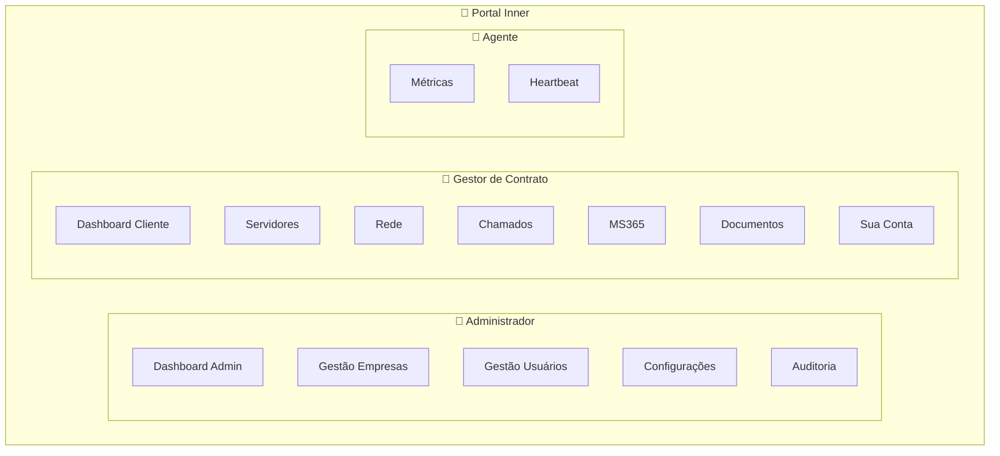
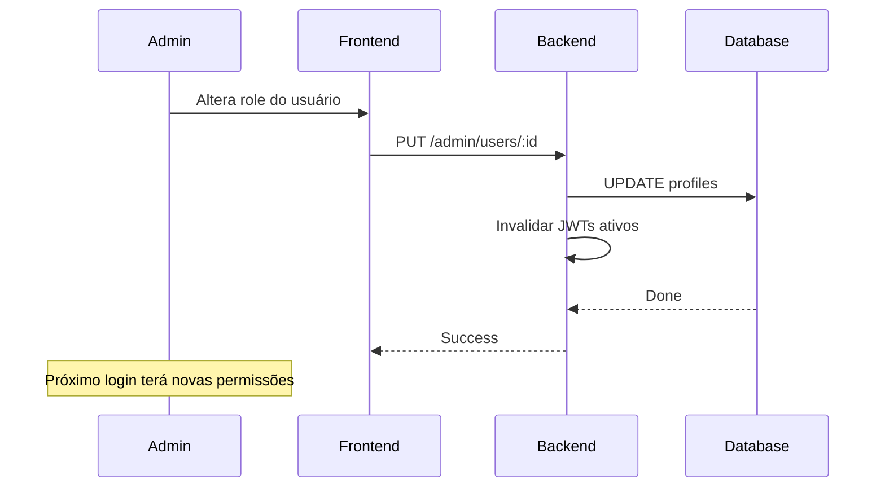

# 🔐 Perfis de Acesso

## Visão Geral

O Portal Inner utiliza um sistema de **RBAC (Role-Based Access Control)** para controlar o acesso aos recursos.

---

## 🎭 Papéis



---

## 📊 Matriz de Permissões

| Recurso | Admin | Cliente | Agente |
|---------|-------|---------|--------|
| **Dashboard Admin** | ✅ | ❌ | ❌ |
| **Dashboard Cliente** | ✅ | ✅ | ❌ |
| **Gestão Empresas** | ✅ | ❌ | ❌ |
| **Gestão Usuários** | ✅ | ❌ | ❌ |
| **Configurações** | ✅ | ❌ | ❌ |
| **Auditoria** | ✅ | ❌ | ❌ |
| **Servidores** | 👁️ Leitura | 👁️ Leitura | ❌ |
| **Rede** | 👁️ Leitura | 👁️ Leitura | ❌ |
| **Chamados GLPI** | 👁️ Leitura | 👁️ Leitura | ❌ |
| **MS365** | 👁️ Leitura | 👁️ Leitura | ❌ |
| **Documentos** | ✏️ Editar | 👁️ Leitura | ❌ |
| **Minha Conta** | ✅ | ✅ | ❌ |
| **Enviar Métricas** | ❌ | ❌ | ✅ |
| **Heartbeat** | ❌ | ❌ | ✅ |

---

## 🔑 JWT Claims

```typescript
interface JWTPayload {
  sub: string;              // user_id
  email: string;
  role: 'admin' | 'client';
  companyId: string;
  contractIds: string[];     // contratos acessíveis
  iat: number;
  exp: number;
}
```

---

## 🛡️ Implementação

### Backend - Middleware de Role

```typescript
// middleware/requireRole.ts
export async function requireRole(roles: ('admin' | 'client')[]) {
  return async (request: FastifyRequest, reply: FastifyReply) => {
    const user = request.user;
    
    if (!user) {
      return reply.status(401).send({ error: 'Unauthorized' });
    }
    
    if (!roles.includes(user.role)) {
      return reply.status(403).send({ error: 'Forbidden' });
    }
  };
}

// Uso
app.get('/admin/users', {
  preHandler: [requireRole(['admin'])]
}, handler);
```

### Frontend - ProtectedRoute

```jsx
// components/ProtectedRoute.jsx
function ProtectedRoute({ children, allowedRoles }) {
  const { user } = useAuth();
  
  if (!user) {
    return <Navigate to="/login" />;
  }
  
  if (allowedRoles && !allowedRoles.includes(user.role)) {
    return <Navigate to="/dashboard" />;
  }
  
  return children;
}

// Uso
<ProtectedRoute allowedRoles={['admin']}>
  <AdminPage />
</ProtectedRoute>
```

---

## 🌐 Isolamento por Empresa

```typescript
// Middleware de escopo
export async function scopeFilter(
  request: FastifyRequest, 
  reply: FastifyReply
) {
  if (request.user.role === 'admin') {
    // Admin vê tudo
    return;
  }
  
  // Cliente só vê dados da própria empresa
  request.scope = {
    companyId: request.user.companyId,
    contractIds: request.user.contractIds
  };
}

// Uso em queries
async function getServers(request: FastifyRequest) {
  const scope = request.scope;
  
  return supabase
    .from('servers')
    .select('*')
    .in('contract_id', scope.contractIds);
}
```

---

## 📋 Auditoria

Todas as ações são logadas:

```typescript
// Log de auditoria
await auditService.log({
  userId: user.id,
  action: 'VIEW',
  resource: 'dashboard',
  ip: request.ip,
  userAgent: request.headers['user-agent']
});
```

---

## 🔄 Atualização de Permissões

Quando um admin altera permissões:



---

> **Última atualização:** 2026-08
