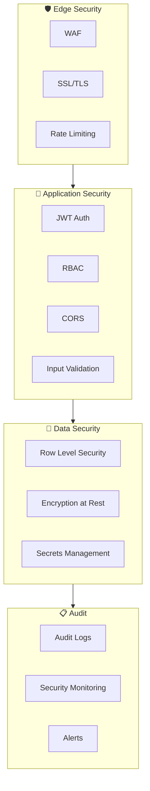
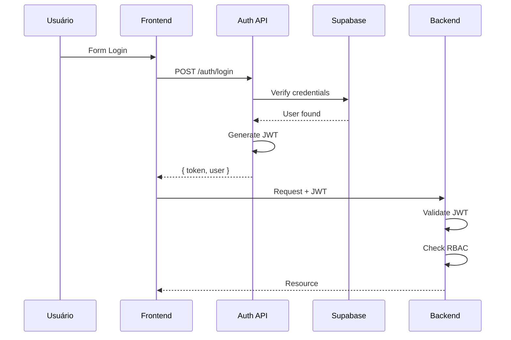
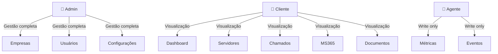
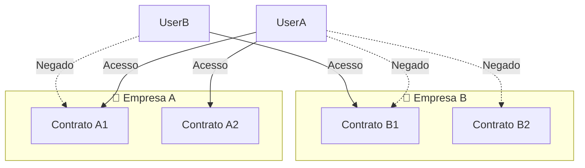
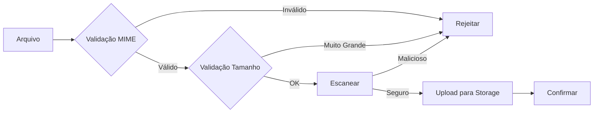

# 🔐 Arquitetura de Segurança

## Visão Geral

A arquitetura de segurança do Portal Inner é projetada para proteger dados sensíveis, garantir a integridade do sistema e manter conformidade com melhores práticas.

---

## 🛡️ Camadas de Segurança



---

## 🔑 Autenticação

### JWT (JSON Web Tokens)

```typescript
// Estrutura do Token JWT
interface JWTToken {
  sub: string;        // User ID
  email: string;      // User email
  role: 'admin' | 'client';
  companyId: string;  // Company scope
  contractId: string; // Contract scope
  iat: number;        // Issued at
  exp: number;        // Expiration
}
```

### Fluxo de Autenticação



### Configuração JWT

```typescript
// backend/src/plugins/jwt.ts
await app.register(jwt, {
  secret: process.env.JWT_SECRET,
  sign: {
    expiresIn: '24h'
  }
});
```

---

## 👥 Controle de Acesso (RBAC)

### Papéis

| Papel | Descrição | Permissões |
|-------|-----------|------------|
| **Admin** | Administrador Inner | Acesso total administrativo |
| **Client** | Gestor de Contrato | Dados do seu contrato |
| **Agent** | Sistema/Agente | Acesso via API token |

### Hierarquia de Permissões



---

## 🌐 Segurança de API

### Validação de Input

```typescript
// Exemplo de schema de validação
const loginSchema = {
  body: {
    type: 'object',
    required: ['email', 'password'],
    properties: {
      email: { type: 'string', format: 'email' },
      password: { type: 'string', minLength: 6 }
    }
  }
};
```

### Rate Limiting

```typescript
// Proteção contra brute force
const rateLimitConfig = {
  max: 5,           // 5 tentativas
  timeWindow: '1m',  // por minuto
  message: 'Muitas tentativas. Tente novamente em 1 minuto.'
};
```

### CORS Configuration

```typescript
// backend/src/plugins/cors.ts
await app.register(cors, {
  origin: process.env.ALLOWED_ORIGINS?.split(','),
  credentials: true,
  methods: ['GET', 'POST', 'PUT', 'DELETE', 'PATCH']
});
```

---

## 🗄️ Segurança de Dados

### Row Level Security (RLS)

```sql
-- Exemplo: Usuários só veem dados do seu contrato
CREATE POLICY "Users see own company data"
ON contracts
FOR ALL
USING (company_id = auth.jwt() ->> 'company_id');

-- Exemplo: Admin vê tudo
CREATE POLICY "Admins see all"
ON contracts
FOR ALL
USING (
  auth.jwt() ->> 'role' = 'admin'
  OR company_id = auth.jwt() ->> 'company_id'
);
```

### Isolamento de Dados



### Criptografia

```typescript
// backend/src/services/crypto-service.ts
import crypto from 'crypto';

const ALGORITHM = 'aes-256-gcm';
const KEY = Buffer.from(process.env.ENCRYPTION_KEY!, 'hex');

export function encrypt(text: string): string {
  const iv = crypto.randomBytes(16);
  const cipher = crypto.createCipheriv(ALGORITHM, KEY, iv);
  
  let encrypted = cipher.update(text, 'utf8', 'hex');
  encrypted += cipher.final('hex');
  
  const authTag = cipher.getAuthTag();
  
  return `${iv.toString('hex')}:${authTag.toString('hex')}:${encrypted}`;
}

export function decrypt(encryptedData: string): string {
  const [ivHex, authTagHex, encrypted] = encryptedData.split(':');
  
  const iv = Buffer.from(ivHex, 'hex');
  const authTag = Buffer.from(authTagHex, 'hex');
  
  const decipher = crypto.createDecipheriv(ALGORITHM, KEY, iv);
  decipher.setAuthTag(authTag);
  
  let decrypted = decipher.update(encrypted, 'hex', 'utf8');
  decrypted += decipher.final('utf8');
  
  return decrypted;
}
```

---

## 📋 Auditoria

### Log de Auditoria

```typescript
// backend/src/services/audit-service.ts
interface AuditLog {
  id: string;
  userId: string;
  action: string;
  resource: string;
  resourceId?: string;
  ip: string;
  userAgent: string;
  timestamp: Date;
  metadata?: Record<string, any>;
}
```

### Eventos Auditados

| Categoria | Eventos |
|-----------|---------|
| **Auth** | Login, Logout, Failed Login, Password Reset |
| **Users** | Create, Update, Delete, Role Change |
| **Companies** | Create, Update, Delete |
| **Documents** | Upload, Download, Delete |
| **Settings** | Config Change |

---

## 🔒 Headers de Segurança

```typescript
// Headers de segurança
const securityHeaders = {
  'X-Content-Type-Options': 'nosniff',
  'X-Frame-Options': 'DENY',
  'X-XSS-Protection': '1; mode=block',
  'Strict-Transport-Security': 'max-age=31536000; includeSubDomains',
  'Content-Security-Policy': "default-src 'self'",
  'Referrer-Policy': 'strict-origin-when-cross-origin'
};
```

---

## 📁 Upload de Arquivos

### Validações

```typescript
const UPLOAD_LIMITS = {
  maxFileSize: 10 * 1024 * 1024,  // 10MB
  maxFiles: 5,
  allowedMimeTypes: [
    'application/pdf',
    'image/jpeg',
    'image/png',
    'application/vnd.openxmlformats-officedocument.wordprocessingml.document'
  ]
};
```

### Fluxo de Upload Seguro



---

## 🚨 Monitoramento de Segurança

### Alertas

| Tipo | Descrição | Ação |
|------|-----------|------|
| **Failed Login** | +5 falhas em 10min | Bloquear IP |
| **Suspicious Activity** | Comportamento atípico | Notificar admin |
| **Data Breach Attempt** | Acesso não autorizado | Bloquear + Alertar |

---

## 📝 Checklist de Segurança

- [ ] JWT com expiração adequada
- [ ] HTTPS em toda comunicação
- [ ] CORS configurado corretamente
- [ ] Validação de input em todas as rotas
- [ ] Rate limiting implementado
- [ ] RLS ativo no banco
- [ ] Credenciais em variáveis de ambiente
- [ ] Logs de auditoria ativos
- [ ] Headers de segurança configurados
- [ ] Upload com validação de MIME/size

---

> **Última atualização:** 2026-08
> **Referências:** [[011-seguranca-aplicacao-e-uploads|Implementação 011]]
