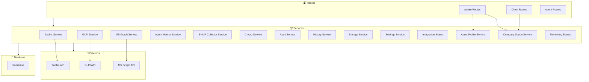

# 📦 Serviços Backend

## Visão Geral

Os serviços encapsulam a lógica de negócio e as integrações com sistemas externos.

---

## 🔗 Diagrama de Serviços



---

## 1. Zabbix Service

**Arquivo:** `services/zabbix-service.ts`

```typescript
interface ZabbixService {
  // Autenticação
  login(): Promise<string>;
  
  // Métricas de servidores
  getServerMetrics(hostId: string): Promise<ServerMetrics>;
  getHistory(hostId: string, itemIds: string[], from: Date, to: Date): Promise<HistoryData[]>;
  
  // Hosts
  getHosts(): Promise<Host[]>;
  getHostById(hostId: string): Promise<Host>;
  
  // Items
  getItems(hostId: string): Promise<Item[]>;
  getItemValue(itemId: string): Promise<any>;
  
  // Alertas
  getAlerts(): Promise<Alert[]>;
}
```

### Métodos Principais

| Método | Descrição |
|--------|-----------|
| `login()` | Autentica na API Zabbix |
| `getServerMetrics()` | Busca métricas de CPU, memória, disco |
| `getHistory()` | Busca histórico de métricas |
| `getHosts()` | Lista todos os hosts |
| `syncServers()` | Sincroniza dados com banco local |

---

## 2. GLPI Service

**Arquivo:** `services/glpi-service.ts`

```typescript
interface GLPIService {
  // Autenticação
  initSession(userToken: string): Promise<string>;
  killSession(sessionToken: string): Promise<void>;
  
  // Tickets
  getTickets(filters: TicketFilters): Promise<Ticket[]>;
  getTicketById(ticketId: string): Promise<Ticket>;
  getTicketStats(contractId: string): Promise<TicketStats>;
  
  // SLA
  getSLAStatus(ticketId: string): Promise<SLAStatus>;
  
  // Categorias
  getCategories(): Promise<Category[]>;
  
  // Users
  getUsers(requesters: number[]): Promise<User[]>;
}
```

### Métodos Principais

| Método | Descrição |
|--------|-----------|
| `initSession()` | Inicia sessão na API GLPI |
| `getTickets()` | Lista tickets com filtros |
| `getTicketById()` | Detalhes de um ticket |
| `getTicketStats()` | Estatísticas SLA |
| `syncTickets()` | Sincroniza tickets com banco |

---

## 3. MS Graph Service

**Arquivo:** `services/ms-graph-service.ts`

```typescript
interface MSGraphService {
  // Token
  getAccessToken(): Promise<string>;
  
  // Usuários
  getUsers(): Promise<MSUser[]>;
  getUserActivity(userId?: string): Promise<ActivityReport>;
  
  // Licenças
  getSubscribedSkus(): Promise<Sku[]>;
  getLicenseUsage(): Promise<LicenseUsage>;
  
  // SharePoint
  getSharePointUsage(): Promise<SharePointUsage>;
  
  // Teams
  getTeamsUsage(): Promise<TeamsUsage>;
}
```

### Métodos Principais

| Método | Descrição |
|--------|-----------|
| `getAccessToken()` | Obtém token OAuth |
| `getUsers()` | Lista usuários do tenant |
| `getLicenseUsage()` | Uso de licenças |
| `getSharePointUsage()` | Armazenamento SharePoint |
| `syncMS365Metrics()` | Sincroniza métricas com banco |

---

## 4. Agent Metrics Service

**Arquivo:** `services/agent-metrics-service.ts`

```typescript
interface AgentMetricsService {
  // Processamento de métricas
  processMetrics(agentId: string, metrics: AgentMetricsInput): Promise<void>;
  
  // Histórico
  getHistory(agentId: string, from: Date, to: Date): Promise<MetricRecord[]>;
  
  // Agregações
  getAggregatedStats(agentId: string, period: 'hour' | 'day'): Promise<AggregatedStats>;
}
```

### Estrutura de Métricas

```typescript
interface AgentMetricsInput {
  cpu: number;        // 0-100%
  memory: number;     // 0-100%
  disk: number;       // 0-100%
  vms: number;        // quantidade
  timestamp: string;  // ISO8601
}
```

---

## 5. SNMP Collector Service

**Arquivo:** `services/snmp-collector-service.ts`

```typescript
interface SNMPCollectorService {
  // Descoberta
  discover(target: string, community: string): Promise<DiscoveredDevice[]>;
  
  // Coleta
  collect(collectorId: string): Promise<SNMPMetrics>;
  
  // Configuração
  getCollectors(): Promise<SNMPCollector[]>;
  createCollector(config: CollectorConfig): Promise<SNMPCollector>;
  updateCollector(id: string, config: CollectorConfig): Promise<void>;
  
  // Devices
  syncDevices(): Promise<void>;
}
```

---

## 6. Crypto Service

**Arquivo:** `services/crypto-service.ts`

```typescript
interface CryptoService {
  // Criptografia simétrica
  encrypt(plaintext: string): string;
  decrypt(ciphertext: string): string;
  
  // Hash
  hash(data: string): string;
  verifyHash(data: string, hash: string): boolean;
  
  // Tokens
  generateToken(): string;
}
```

### Algoritmos

| Operação | Algoritmo |
|----------|-----------|
| Criptografia | AES-256-GCM |
| Hash | SHA-256 |
| Token | Random 32 bytes (hex) |

---

## 7. Audit Service

**Arquivo:** `services/audit-service.ts`

```typescript
interface AuditService {
  // Logging
  log(event: AuditEvent): Promise<void>;
  
  // Query
  getLogs(filters: AuditFilters): Promise<AuditLog[]>;
  getLogById(id: string): Promise<AuditLog>;
  
  // Relatórios
  getActivityReport(userId: string, from: Date, to: Date): Promise<ActivityReport>;
}
```

### Tipos de Evento

```typescript
type AuditEventType = 
  | 'LOGIN'
  | 'LOGOUT'
  | 'LOGIN_FAILED'
  | 'PASSWORD_RESET'
  | 'USER_CREATED'
  | 'USER_UPDATED'
  | 'USER_DELETED'
  | 'USER_BLOCKED'
  | 'COMPANY_CREATED'
  | 'COMPANY_UPDATED'
  | 'COMPANY_DELETED'
  | 'DOCUMENT_UPLOADED'
  | 'DOCUMENT_DELETED'
  | 'SETTINGS_CHANGED'
  | 'INTEGRATION_CONFIGURED';
```

---

## 8. History Service

**Arquivo:** `services/history-service.ts`

```typescript
interface HistoryService {
  // Armazenamento
  recordMetric(record: MetricRecord): Promise<void>;
  recordBatch(records: MetricRecord[]): Promise<void>;
  
  // Consulta
  getHistory(
    entityType: string,
    entityId: string,
    from: Date,
    to: Date,
    granularity: 'minute' | 'hour' | 'day'
  ): Promise<HistoricalData[]>;
  
  // Agregações
  getAverages(entityId: string, period: Period): Promise<Averages>;
  getPeaks(entityId: string, period: Period): Promise<PeakData[]>;
}
```

---

## 9. Storage Service

**Arquivo:** `services/storage-service.ts`

```typescript
interface StorageService {
  // Upload
  upload(bucket: string, path: string, file: Buffer, metadata?: object): Promise<StorageFile>;
  
  // Download
  download(bucket: string, path: string): Promise<Buffer>;
  
  // Gestão
  delete(bucket: string, path: string): Promise<void>;
  list(bucket: string, prefix?: string): Promise<StorageFile[]>;
  
  // URLs
  getPublicUrl(bucket: string, path: string): string;
}
```

### Buckets

| Bucket | Uso |
|--------|-----|
| `documents` | Documentos técnicos |
| `avatars` | Avatares de usuários |
| `exports` | Exports (CSV, PDF) |

---

## 10. Settings Service

**Arquivo:** `services/settings-service.ts`

```typescript
interface SettingsService {
  // Leitura
  get(key: string): Promise<any>;
  getAll(): Promise<Record<string, any>>;
  
  // Escrita
  set(key: string, value: any): Promise<void>;
  setBatch(settings: Record<string, any>): Promise<void>;
  
  // Tipos
  getByCategory(category: string): Promise<Setting[]>;
}
```

---

## 11. Integration Status Service

**Arquivo:** `services/integration-status-service.ts`

```typescript
interface IntegrationStatusService {
  // Status
  getStatus(companyId: string, integration: IntegrationType): Promise<IntegrationStatus>;
  getAllStatuses(companyId: string): Promise<IntegrationStatus[]>;
  
  // Heartbeat
  recordHeartbeat(companyId: string, integration: IntegrationType): Promise<void>;
  
  // Sync
  recordSync(companyId: string, integration: IntegrationType, result: SyncResult): Promise<void>;
  
  // Alertas
  getLastSyncErrors(companyId: string): Promise<SyncError[]>;
}
```

---

## 12. Asset Profile Service

**Arquivo:** `services/asset-profile-service.ts`

```typescript
interface AssetProfileService {
  // CRUD
  create(profile: AssetProfileInput): Promise<AssetProfile>;
  update(id: string, profile: Partial<AssetProfileInput>): Promise<void>;
  delete(id: string): Promise<void>;
  
  // Consulta
  getById(id: string): Promise<AssetProfile>;
  getByCompany(companyId: string): Promise<AssetProfile[]>;
  
  // Visibilidade
  setCustomerVisibility(profileId: string, visible: boolean): Promise<void>;
}
```

---

## 13. Company Scope Service

**Arquivo:** `services/company-scope-service.ts`

```typescript
interface CompanyScopeService {
  // Escopo
  getScope(companyId: string): Promise<CompanyScope>;
  validateAccess(userId: string, resourceCompanyId: string): Promise<boolean>;
  
  // Filtros automáticos
  applyScopeFilter(query: SupabaseQuery, companyId: string): SupabaseQuery;
}
```

---

## 14. Monitoring Events Service

**Arquivo:** `services/monitoring-events-service.ts`

```typescript
interface MonitoringEventsService {
  // Registro
  recordEvent(event: MonitoringEvent): Promise<void>;
  
  // Consulta
  getEvents(filters: EventFilters): Promise<MonitoringEvent[]>;
  getEventsByServer(serverId: string, limit?: number): Promise<MonitoringEvent[]>;
  
  // Alertas
  checkThresholds(metrics: ServerMetrics): Promise<Alert[]>;
}
```

---

> **Última atualização:** 2026-08
