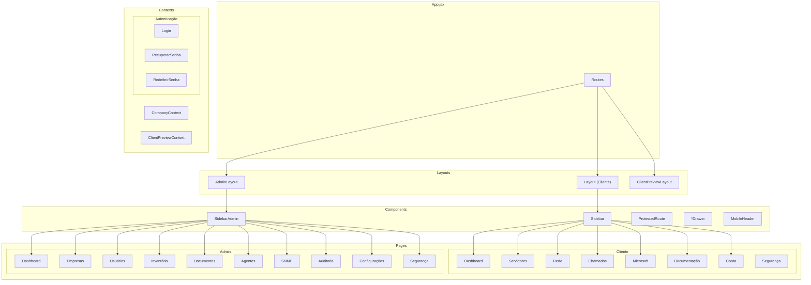

# 🎯 Visão Geral do Frontend

## Arquitetura de Componentes



---

## 📁 Estrutura de Arquivos

```
web/src/
├── main.jsx                    # Entry point
├── App.jsx                     # Root component
│
├── components/                 # Componentes compartilhados
│   ├── AssetDetailDrawer.jsx   # Drawer de ativo
│   ├── MobileHeader.jsx        # Header mobile
│   ├── ProtectedRoute.jsx      # HOC proteção
│   ├── Sidebar.jsx             # Sidebar cliente
│   ├── SidebarAdmin.jsx        # Sidebar admin
│   └── TicketDetailDrawer.jsx  # Drawer de ticket
│
├── contexts/                   # React Contexts
│   ├── AuthContext.jsx         # Autenticação
│   ├── CompanyContext.jsx       # Dados da empresa
│   └── ClientPreviewContext.jsx # Preview mode
│
├── layouts/                    # Layouts
│   ├── layout.jsx              # Layout cliente
│   ├── AdminLayout.jsx         # Layout admin
│   └── ClientPreviewLayout.jsx  # Layout preview
│
├── pages/                      # Páginas
│   │
│   ├── Login/                  # Autenticação
│   │   ├── login.jsx
│   │   ├── login.module.css
│   │   └── login.test.jsx
│   │
│   ├── RecuperarSenha/
│   │   └── recuperarSenha.jsx
│   │
│   ├── RedefinirSenha/
│   │   └── redefinirSenha.jsx
│   │
│   ├── paginasAdmin/           # Admin
│   │   ├── agentesAdmin/
│   │   ├── auditAdmin/
│   │   ├── configAdmin/
│   │   ├── dashAdmin/
│   │   ├── docAdmin/
│   │   ├── empresasAdmin/
│   │   ├── inventarioAdmin/
│   │   ├── segurancaAdmin/
│   │   ├── snmp/
│   │   └── usuariosAdmin/
│   │
│   └── paginasClient/          # Cliente
│       ├── ChamadosGLPI/
│       ├── Conta/
│       ├── Dashboard/
│       ├── Documentação/
│       ├── Microsoft/
│       ├── Rede/
│       ├── Segurança/
│       └── Servidores/
│
└── rotas/
    └── rotas.jsx               # Definição de rotas
```

---

## 🎨 Padrões de Componentes

### Exemplo: Card de Status

```jsx
// components/StatusCard.jsx
import { Card, CardContent, CardHeader } from '@/components/ui';

export function StatusCard({ 
  title, 
  value, 
  icon: Icon, 
  trend, 
  status = 'default' 
}) {
  const statusColors = {
    default: 'border-gray-200',
    success: 'border-green-500',
    warning: 'border-yellow-500',
    danger: 'border-red-500'
  };
  
  return (
    <Card className={statusColors[status]}>
      <CardHeader className="flex flex-row items-center justify-between">
        <span className="text-sm font-medium">{title}</span>
        {Icon && <Icon className="w-4 h-4 text-gray-500" />}
      </CardHeader>
      <CardContent>
        <div className="text-2xl font-bold">{value}</div>
        {trend && (
          <span className={`text-xs ${trend > 0 ? 'text-red-500' : 'text-green-500'}`}>
            {trend > 0 ? '↑' : '↓'} {Math.abs(trend)}%
          </span>
        )}
      </CardContent>
    </Card>
  );
}
```

### Exemplo: ProtectedRoute

```jsx
// components/ProtectedRoute.jsx
import { Navigate } from 'react-router-dom';
import { useAuth } from '@/contexts/AuthContext';

export function ProtectedRoute({ children, allowedRoles }) {
  const { user, isAuthenticated } = useAuth();
  
  if (!isAuthenticated) {
    return <Navigate to="/login" replace />;
  }
  
  if (allowedRoles && !allowedRoles.includes(user?.role)) {
    return <Navigate to="/dashboard" replace />;
  }
  
  return children;
}

// Uso:
<ProtectedRoute allowedRoles={['admin']}>
  <AdminPage />
</ProtectedRoute>
```

---

## 📡 Chamadas de API

### Axios Instance

```javascript
// lib/api.js
import axios from 'axios';

const api = axios.create({
  baseURL: import.meta.env.VITE_API_URL,
  timeout: 30000,
  headers: {
    'Content-Type': 'application/json'
  }
});

// Interceptor de request
api.interceptors.request.use(
  config => {
    const token = localStorage.getItem('token');
    if (token) {
      config.headers.Authorization = `Bearer ${token}`;
    }
    return config;
  },
  error => Promise.reject(error)
);

// Interceptor de response
api.interceptors.response.use(
  response => response,
  async error => {
    if (error.response?.status === 401) {
      localStorage.removeItem('token');
      window.location.href = '/login';
    }
    return Promise.reject(error);
  }
);

export default api;
```

### Hooks de Dados

```javascript
// hooks/useDashboard.js
import { useState, useEffect } from 'react';
import api from '@/lib/api';

export function useDashboard(contractId) {
  const [data, setData] = useState(null);
  const [loading, setLoading] = useState(true);
  const [error, setError] = useState(null);
  
  useEffect(() => {
    async function fetchData() {
      try {
        setLoading(true);
        const response = await api.get(`/client/dashboard/summary/${contractId}`);
        setData(response.data);
      } catch (err) {
        setError(err.message);
      } finally {
        setLoading(false);
      }
    }
    
    fetchData();
  }, [contractId]);
  
  return { data, loading, error, refetch };
}
```

---

## 🎭 Temas e Estilos

### Configuração Tailwind

```javascript
// tailwind.config.js
module.exports = {
  content: ['./index.html', './src/**/*.{js,jsx}'],
  theme: {
    extend: {
      colors: {
        primary: {
          50: '#eff6ff',
          100: '#dbeafe',
          500: '#3b82f6',
          600: '#2563eb',
          700: '#1d4ed8',
        },
      },
    },
  },
  plugins: [],
};
```

### Breakpoints

| Nome | Largura | Uso |
|------|---------|-----|
| `sm` | 640px | Mobile landscape |
| `md` | 768px | Tablets |
| `lg` | 1024px | Laptops |
| `xl` | 1280px | Desktops |
| `2xl` | 1536px | Large screens |

---

## 📱 Responsividade

### Exemplo: Sidebar Responsiva

```jsx
function Sidebar() {
  const [isMobileOpen, setIsMobileOpen] = useState(false);
  
  return (
    <>
      {/* Mobile Toggle */}
      <button 
        className="lg:hidden p-2"
        onClick={() => setIsMobileOpen(true)}
      >
        <MenuIcon />
      </button>
      
      {/* Desktop Sidebar */}
      <aside className="hidden lg:block w-64 bg-gray-900">
        {/* ... conteúdo */}
      </aside>
      
      {/* Mobile Sidebar */}
      {isMobileOpen && (
        <div className="lg:hidden fixed inset-0 z-50">
          <div 
            className="fixed inset-0 bg-black/50"
            onClick={() => setIsMobileOpen(false)}
          />
          <aside className="fixed left-0 top-0 w-64 h-full bg-gray-900">
            {/* ... conteúdo */}
          </aside>
        </div>
      )}
    </>
  );
}
```

---

## 🧪 Testes

### Estrutura

```
web/src/
├── pages/
│   └── paginasClient/
│       └── Conta/
│           ├── conta.jsx
│           └── conta.test.jsx
└── components/
    └── StatusCard/
        ├── StatusCard.jsx
        └── StatusCard.test.jsx
```

### Exemplo de Teste

```jsx
// conta.test.jsx
import { render, screen, fireEvent, waitFor } from '@testing-library/react';
import { vi } from 'vitest';
import { BrowserRouter } from 'react-router-dom';
import { AuthProvider } from '@/contexts/AuthContext';
import Conta from './conta';

const renderWithProviders = (ui) => {
  return render(
    <BrowserRouter>
      <AuthProvider>
        {ui}
      </AuthProvider>
    </BrowserRouter>
  );
};

describe('Conta', () => {
  it('deve renderizar o nome do usuário', () => {
    renderWithProviders(<Conta />);
    expect(screen.getByText('João Silva')).toBeInTheDocument();
  });
  
  it('deve abrir modal de edição ao clicar', async () => {
    renderWithProviders(<Conta />);
    fireEvent.click(screen.getByRole('button', { name: /editar/i }));
    await waitFor(() => {
      expect(screen.getByLabelText(/nome/i)).toBeInTheDocument();
    });
  });
});
```

---

> **Última atualização:** 2026-08
