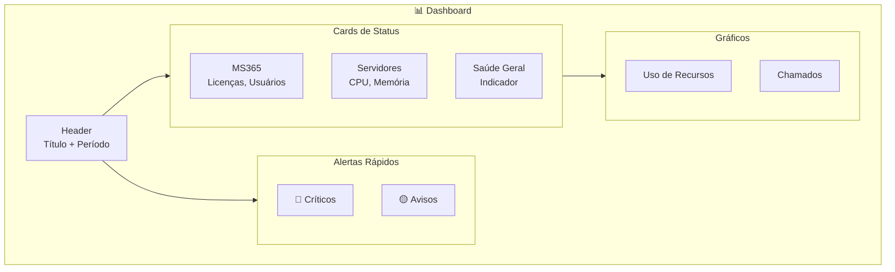
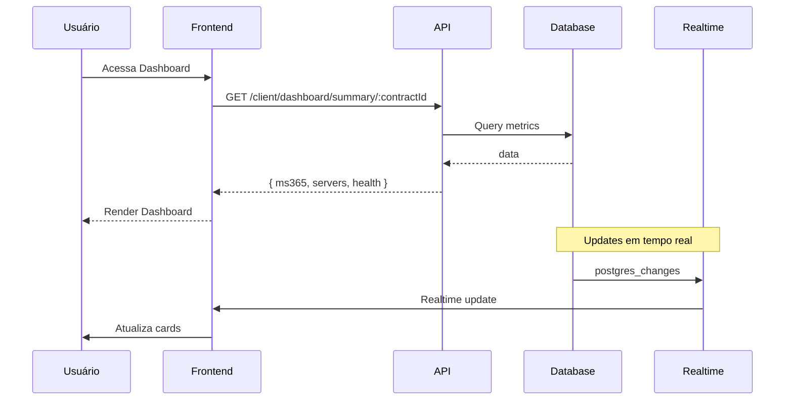

# 📊 Dashboard - Diagrama de Componentes

## Visão Geral

O Dashboard é o componente central do Portal Inner, exibindo uma visão consolidada do estado da infraestrutura do cliente.

---

## 🏗️ Estrutura do Dashboard



---

## 📱 Layout Responsivo

### Desktop (lg+)

```
┌─────────────────────────────────────────────┐
│ Header: Dashboard + Seletor de Período      │
├─────────────────────────────────────────────┤
│ ┌─────────┐ ┌─────────┐ ┌─────────┐        │
│ │  MS365  │ │Servidor │ │ Saúde   │        │
│ │  Card   │ │  Card   │ │  Card   │        │
│ └─────────┘ └─────────┘ └─────────┘        │
├─────────────────────────────────────────────┤
│ ┌──────────────────┐ ┌──────────────────┐  │
│ │  Gráfico Uso     │ │  Chamados        │  │
│ │  Recursos        │ │  Recentes        │  │
│ └──────────────────┘ └──────────────────┘  │
├─────────────────────────────────────────────┤
│ Alertas Rápidos                            │
└─────────────────────────────────────────────┘
```

### Mobile (< lg)

```
┌─────────────────────┐
│ Header              │
├─────────────────────┤
│ ┌─────────────────┐ │
│ │    MS365 Card    │ │
│ └─────────────────┘ │
│ ┌─────────────────┐ │
│ │  Servidores Card │ │
│ └─────────────────┘ │
│ ┌─────────────────┐ │
│ │   Saúde Card     │ │
│ └─────────────────┘ │
│ ┌─────────────────┐ │
│ │   Gráfico Uso    │ │
│ └─────────────────┘ │
│ ┌─────────────────┐ │
│ │   Chamados       │ │
│ └─────────────────┘ │
└─────────────────────┘
```

---

## 🔗 Integração com Backend



---

## 📡 API Endpoint

```typescript
// GET /api/client/dashboard/summary/:contractId

interface DashboardSummary {
  contractId: string;
  period: {
    from: Date;
    to: Date;
  };
  
  ms365: {
    status: 'healthy' | 'warning' | 'critical';
    totalUsers: number;
    activeUsers: number;
    licensesUsed: number;
    licensesTotal: number;
  };
  
  servers: {
    total: number;
    online: number;
    offline: number;
    warning: number;
    avgCpu: number;
    avgMemory: number;
  };
  
  health: {
    score: number;      // 0-100
    status: 'healthy' | 'warning' | 'critical';
    factors: HealthFactor[];
  };
  
  alerts: Alert[];
  
  recentTickets: Ticket[];
}
```

---

## 🎨 Componentes

| Componente | Arquivo | Descrição |
|------------|---------|-----------|
| `Dashboard` | `pages/paginasClient/Dashboard/dashboard.jsx` | Página principal |
| `StatusCard` | `components/StatusCard.jsx` | Card genérico |
| `HealthIndicator` | `components/HealthIndicator.jsx` | Indicador saúde |
| `AlertList` | `components/AlertList.jsx` | Lista de alertas |
| `UsageChart` | `components/UsageChart.jsx` | Gráfico Recharts |

---

## 🔄 Atualização em Tempo Real

```javascript
// Subscreva a mudanças
const channel = supabase
  .channel('dashboard-updates')
  .on('postgres_changes', {
    event: '*',
    schema: 'public',
    table: 'ms365_metrics',
    filter: `company_id=eq.${companyId}`
  }, handleMS365Update)
  .on('postgres_changes', {
    event: '*',
    schema: 'public', 
    table: 'servers',
    filter: `company_id=eq.${companyId}`
  }, handleServerUpdate)
  .subscribe();

// Cleanup
return () => {
  supabase.removeChannel(channel);
};
```

---

## 📊 Dados do Gráfico

```typescript
// Estrutura para gráficos Recharts
interface ChartDataPoint {
  timestamp: string;  // HH:mm
  cpu: number;
  memory: number;
  network: number;
}

// Exemplo
const chartData = [
  { timestamp: '08:00', cpu: 45, memory: 62, network: 120 },
  { timestamp: '09:00', cpu: 52, memory: 65, network: 180 },
  { timestamp: '10:00', cpu: 48, memory: 63, network: 150 },
];
```

---

> **Última atualização:** 2026-08
