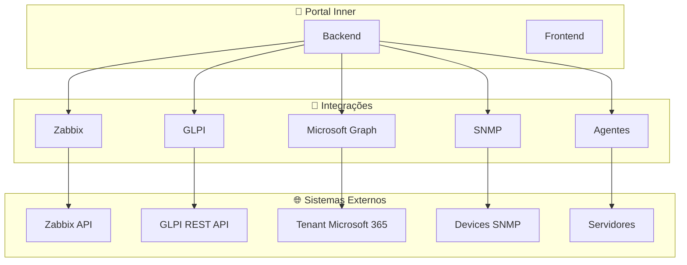
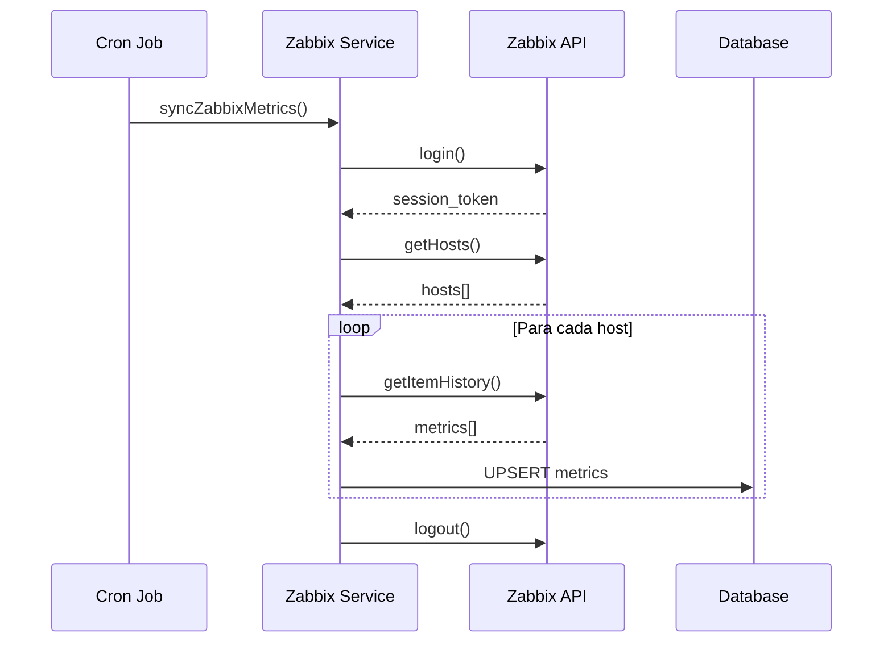
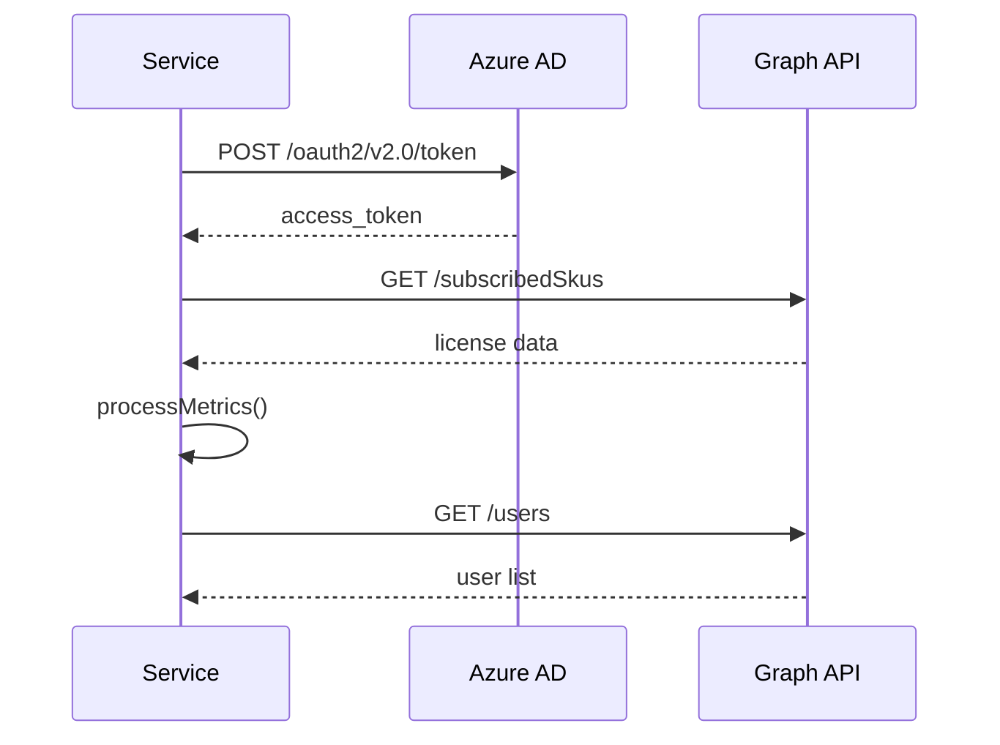
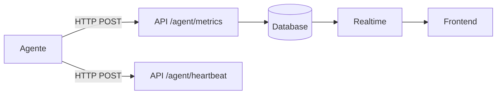
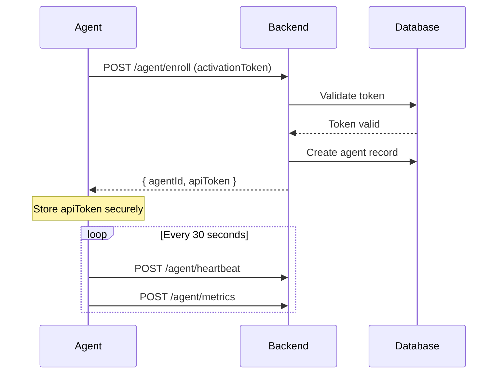

# 🔌 Integrações

## Visão Geral

O Portal Inner integra-se com sistemas externos para coletar e consolidar dados de monitoramento.

---

## 🔗 Diagrama de Integrações



---

## 1. Zabbix Integration

### Visão Geral

Integração com **Zabbix** para coleta de métricas de servidores e dispositivos de rede.

### Configuração

```typescript
// Variáveis de ambiente
ZABBIX_URL=https://zabbix.example.com
ZABBIX_USER=api_user
ZABBIX_PASSWORD=api_password
```

### Dados Coletados

| Métrica | Tipo | Frequência |
|---------|------|------------|
| CPU Usage | percentage | 30s |
| Memory Usage | percentage | 30s |
| Disk Usage | percentage | 60s |
| Network In/Out | bytes/s | 30s |
| Uptime | seconds | 60s |

### Serviço

```typescript
// services/zabbix-service.ts
class ZabbixService {
  async login(): Promise<string>
  async getHosts(): Promise<Host[]>
  async getItemHistory(itemIds: string[], from: Date): Promise<History[]>
  async getServerMetrics(hostId: string): Promise<ServerMetrics>
}
```

### Fluxo



---

## 2. GLPI Integration

### Visão Geral

Integração com **GLPI** para sincronização de chamados e indicadores SLA.

### Configuração

```typescript
// Variáveis de ambiente
GLPI_URL=https://glpi.example.com
GLPI_APP_TOKEN=xxxx
GLPI_USER_TOKEN=xxxx
```

### Dados Coletados

| Dado | Descrição |
|------|-----------|
| Tickets | Chamados do contrato |
| Status | Status atual |
| SLA | Tempos de resposta/resolução |
| Categorias | Tipos de chamado |
| Usuários | Solicitantes e técnicos |

### Serviço

```typescript
// services/glpi-service.ts
class GLPIService {
  async initSession(): Promise<string>
  async getTickets(filters: TicketFilters): Promise<Ticket[]>
  async getTicketStats(contractId: string): Promise<TicketStats>
  async killSession(): Promise<void>
}
```

### Mapeamento de Status

| GLPI Status | Portal Status |
|-------------|---------------|
| New | novo |
| Assigned | em_andamento |
| Planned | planejado |
| Waiting | aguardando |
| Solved | resolvido |
| Closed | fechado |

---

## 3. Microsoft 365 Integration

### Visão Geral

Integração com **Microsoft Graph API** para métricas de licenciamento e uso do Microsoft 365.

### Configuração

```typescript
// Variáveis de ambiente
MS_TENANT_ID=xxxx
MS_CLIENT_ID=xxxx
MS_CLIENT_SECRET=xxxx
```

### Dados Coletados

| Dado | API Endpoint |
|------|-------------|
| Licenças | `/subscribedSkus` |
| Usuários | `/users` |
| Atividade | `/reports/getOffice365ServicesUserCounts` |
| SharePoint | `/sites/getSitesByHostname` |

### Serviço

```typescript
// services/ms-graph-service.ts
class MSGraphService {
  async getAccessToken(): Promise<string>
  async getLicenseUsage(): Promise<LicenseUsage>
  async getUsers(): Promise<MSUser[]>
  async getSharePointUsage(): Promise<SharePointUsage>
}
```

### Fluxo OAuth



---

## 4. SNMP Integration

### Visão Geral

Coletor SNMP para descoberta e monitoramento de dispositivos de rede.

### Configuração

```typescript
// snmp-collectors
interface SNMPCollector {
  id: string;
  name: string;
  targetIp: string;
  community: string;  // v1/v2c
  version: 'v1' | 'v2c' | 'v3';
  v3Config?: {
    securityName: string;
    authProtocol: 'MD5' | 'SHA';
    authKey: string;
    privProtocol: 'DES' | 'AES';
    privKey: string;
  };
}
```

### OIDs Comuns

| OID | Métrica |
|-----|---------|
| `1.3.6.1.2.1.1.3.0` | Uptime |
| `1.3.6.1.2.1.2.1.0` | Interfaces Count |
| `1.3.6.1.2.1.2.2.1.*` | Interface Stats |
| `1.3.6.1.2.1.25.1.1.0` | Host Uptime |

### Serviço

```typescript
// services/snmp-collector-service.ts
class SNMPCollectorService {
  async discover(target: string, community: string): Promise<Device[]>
  async collect(collectorId: string): Promise<SNMPMetrics>
  async syncDevices(): Promise<void>
}
```

---

## 5. Agentes (Python/PowerShell)

### Visão Geral

Agentes instalados nos servidores para coleta de métricas detalhadas.

### Arquitetura



### Métricas Coletadas

```json
{
  "cpu": 45.2,
  "memory": 67.8,
  "disk": 52.1,
  "vms": 3,
  "timestamp": "2026-08-01T10:30:00Z"
}
```

### Registration Flow



---

## 🔄 Scheduler de Sincronização

```typescript
// jobs/sync-scheduler.ts
cron.schedule('*/30 * * * * *', async () => {
  // Zabbix - métricas a cada 30s
  await syncZabbixMetrics();
});

cron.schedule('*/60 * * * * *', async () => {
  // Zabbix - network a cada 60s
  await syncZabbixNetwork();
});

cron.schedule('*/30 * * * *', async () => {
  // GLPI - tickets a cada 30min
  await syncGLPITickets();
});

cron.schedule('0 */6 * * *', async () => {
  // MS365 - métricas a cada 6h
  await syncMS365Metrics();
});
```

---

## 📊 Status de Integração

```typescript
interface IntegrationStatus {
  integration: 'zabbix' | 'glpi' | 'ms365';
  status: 'ok' | 'error' | 'syncing';
  lastSync: Date;
  nextSync: Date;
  lastError?: string;
  recordsSynced: number;
}
```

---

## ⚠️ Tratamento de Erros

### Retry Policy

```typescript
const retryConfig = {
  maxRetries: 3,
  initialDelay: 1000,  // ms
  backoffMultiplier: 2
};
```

### Circuit Breaker

```typescript
// Se 5 falhas consecutivas, abre circuit breaker por 60s
const circuitBreaker = {
  failureThreshold: 5,
  resetTimeout: 60000  // ms
};
```

---

> **Última atualização:** 2026-08
