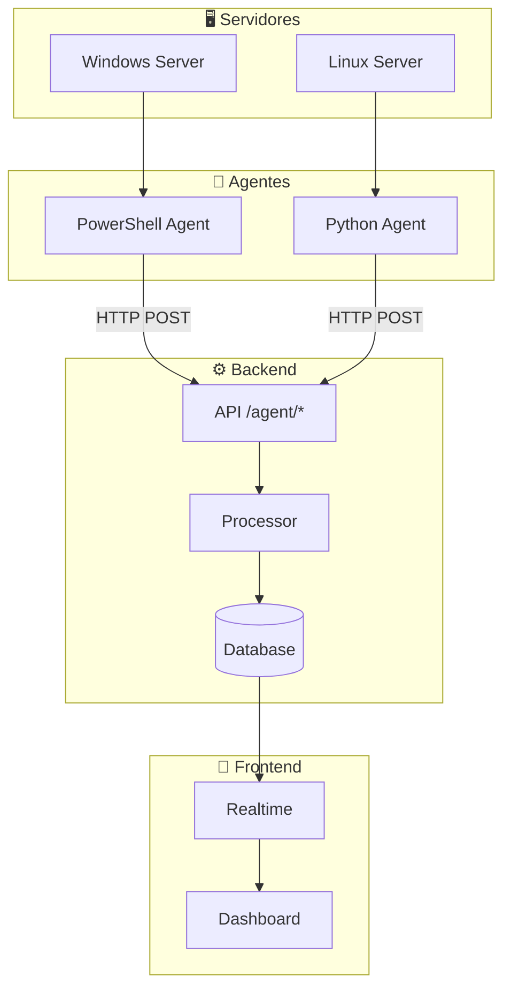
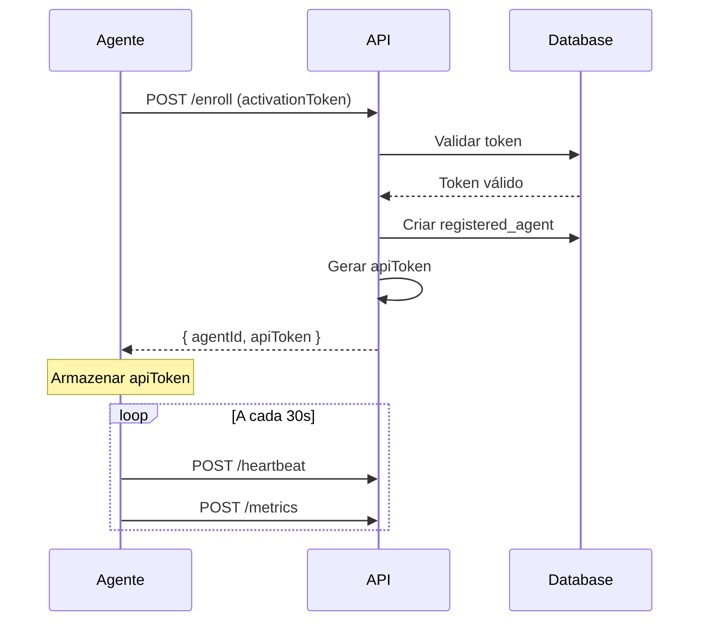
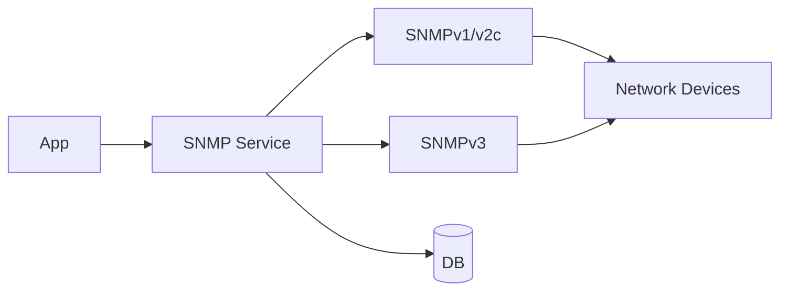

# 🤖 Agentes de Monitoramento

## Visão Geral

O Portal Inner utiliza agentes para coleta de métricas detalhadas dos servidores clientes.

---

## 🏗️ Arquitetura de Agentes



---

## 📁 Tipos de Agente

| Agente                 | Plataforma     | Linguagem   | Status                |
| ---------------------- | -------------- | ----------- | --------------------- |
| **inner-agent.ps1**    | Windows        | PowerShell  | 🟢 Ativo              |
| **inner-collector.js** | Cross-platform | JavaScript  | 🟡 Em desenvolvimento |
| **inner-endpoint.js**  | Cross-platform | JavaScript  | 🟡 Em desenvolvimento |
| **coletor-snmp/**      | Cross-platform | C# (.NET 8) | 🟡 Em desenvolvimento |

---

## 🔧 PowerShell Agent

**Localização:** `agente/inner-agent.ps1`

### Funcionalidades

- Coleta de métricas de CPU, memória, disco
- Detecção de VMs (Hyper-V, VMware)
- Heartbeat periódico
- Reconexão automática

### Métricas Coletadas

```powershell
# CPU
(Get-Counter '\Processor(_Total)\% Processor Time').CounterSamples.CookedValue

# Memória
$os = Get-Ciminstance Win32_OperatingSystem
[math]::Round((($os.TotalVisibleMemorySize - $os.FreePhysicalMemory) / $os.TotalVisibleMemorySize) * 100, 2)

# Disco
Get-Ciminstance Win32_LogicalDisk -Filter "DriveType=3" | Select-Object DeviceID, @{N='Usage';E={[math]::Round((($_.Size - $_.FreeSpace) / $_.Size) * 100, 2)}}

# VMs
(Get-VM).Count
```

### Configuração

```powershell
# Parâmetros do script
param(
    [Parameter(Mandatory=$true)]
    [string]$ApiUrl,
    
    [Parameter(Mandatory=$true)]
    [string]$ActivationToken,
    
    [int]$IntervalSeconds = 30
)
```

### Execução

```powershell
# Windows Task Scheduler (recomendado)
$action = New-ScheduledTaskAction -Execute "powershell.exe" -Argument "-File C:\Agents\inner-agent.ps1 -ApiUrl 'https://api.example.com' -ActivationToken 'TOKEN'"
$trigger = New-ScheduledTaskTrigger -Once -At (Get-Date) -RepetitionInterval (New-TimeSpan -Seconds 30) -RepetitionDuration ([TimeSpan]::MaxValue)
Register-ScheduledTask -Action $action -Trigger $trigger -TaskName "InnerAgent" -Description "Inner Portal Monitoring Agent"
```

---

## 📡 API de Agentes

### Endpoints

| Método | Rota | Descrição |
|--------|------|-----------|
| POST | `/api/agent/enroll` | Registro do agente |
| POST | `/api/agent/metrics` | Envio de métricas |
| POST | `/api/agent/heartbeat` | Heartbeat |
| GET | `/api/agent/config` | Configuração |

### Fluxo de Registro



### Estrutura de Métricas

```typescript
// Request: POST /api/agent/metrics
interface AgentMetrics {
  cpu: number;       // 0-100 (%)
  memory: number;    // 0-100 (%)
  disk: number;      // 0-100 (%)
  vms: number;       // quantidade
  timestamp: string; // ISO8601
}

// Headers
Authorization: Bearer <api_token>
Content-Type: application/json
```

---

## 🔄 SNMP Collector

**Localização:** `coletor-snmp/`

### Arquitetura



### Funcionalidades

- Descoberta automática de dispositivos
- Suporte SNMP v1, v2c, v3
- Coleta de interfaces de rede
- Monitoramento de uptime

### Configuração

```json
// appsettings.json
{
  "Snmp": {
    "Version": "v2c",
    "Community": "public",
    "Timeout": 5000,
    "Retries": 3
  },
  "Api": {
    "BaseUrl": "https://api.innertech.com.br",
    "ApiKey": "your-api-key"
  }
}
```

---

## 📊 Monitoramento de Agentes

### Admin Dashboard

O painel administrativo exibe:

| Métrica              | Descrição                     |
| -------------------- | ----------------------------- |
| **Status**           | Online/Offline/Heartbeat lost |
| **Último Heartbeat** | Timestamp                     |
| **CPU/Mem/Disco**    | Último valor                  |
| **Uptime**           | Tempo online                  |

### Alertas

| Condição | Ação |
|----------|------|
| Sem heartbeat por 5min | ⚠️ Warning |
| Sem heartbeat por 15min | 🔴 Critical |
| Métricas acima do threshold | 📧 Email notification |

---

## 🔒 Segurança

### Autenticação

- Tokens de API únicos por agente
- Tokens criptografados no banco (AES-256-GCM)
- Renovação periódica de tokens

### Validação

```typescript
// Backend: Validar agente antes de aceitar métricas
async function validateAgent(apiToken: string): Promise<Agent> {
  const decrypted = cryptoService.decrypt(apiToken);
  const agent = await db.registered_agents.findFirst({
    where: { apiToken: decrypted, status: 'active' }
  });
  
  if (!agent) throw new UnauthorizedError();
  return agent;
}
```

---

> **Última atualização:** 2026-08
